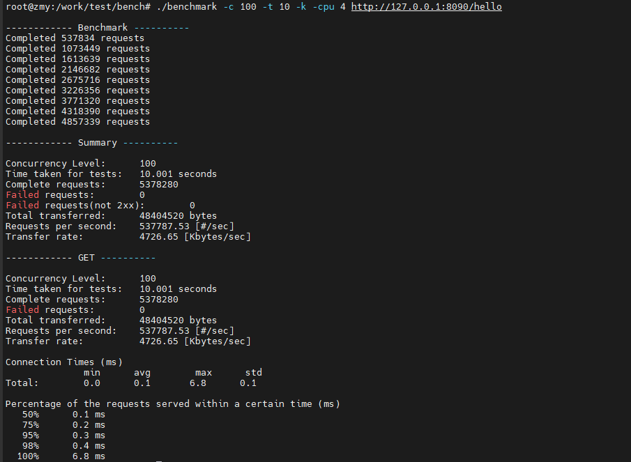

`bst-http` is a simple package based on the [Boost.Beast](https://www.boost.org/doc/libs/release/libs/beast/) framework and `boost::asio::co_spawn` (C++20).  
We provide a convenient router registration mechanism for internal API calls.

The framework uses Boost.Asio's coroutine mechanism, combined with simple packaging, resulting in minimal performance loss.

**No-load performance test reference:**

